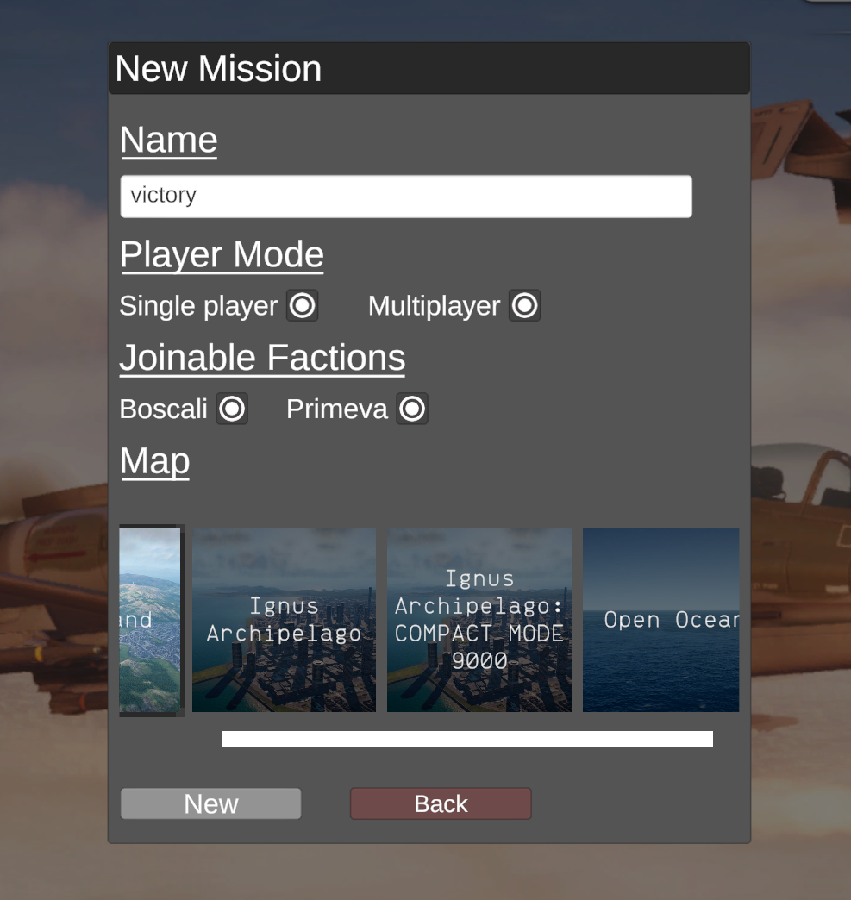

# NOMapLoader: Nuclear Option Map Loader
 External map loader for Nuclear Option, supporting both independent and blueprinter loaded maps (for replacing assets). 
 Supports a theoretically infinite amount of custom maps by replacing the new map popup (see below). 
 
 Current known issues:
 - Custom maps still require a reference to the FactionHQ of the various factions in order to setup music. This currently requires blueprinter, which means independent maps will not support music currently.
 - ...

## Usage:
 Install like any other BepInEx mod (drop into plugins folder) 
 Ensure downloaded map bundles if independent are in the same folder as the dll. Blueprinter bundles will be scanned automatically.

## Creating Custom Maps:
 Creating custom maps requires a unity project setup in the following ways:
 - Unity 2022.3.62f2 (or current Nuclear Option unity version if this changes)
 - Project has reference to Nuclear Option assemblies (Assembly-CSharp.dll), either setup manually or with [ThunderKit](https://github.com/PassivePicasso/ThunderKit)
 - A way to build asset bundles, I use [AssetBundles-Browser](https://github.com/Unity-Technologies/AssetBundles-Browser)

 Create your map as defined below, load all needed assets into a bundle, and package. Then, install as defined above.

### Basic Map Structure:
 A basic map only requires the following:
 - Prefab Containing the following
 - NetworkMap component
 - MapSettings component
   - Reference to NetworkMap
   - Correct map size
   - Grid size (reference: heartland is 16x16)
   - Optional OffsetX, OffsetY (not sure of use) and Latitude
   - Road Networks and Sea Lanes if required
   - Reflection probe point (for static reflections I believe)
   - Ocean Basecolor, Depthmap, Terrain Colormap, Map image
   - Music (Issue: See above)
   - ...
 - TerrainScatter component
   - MapSettings reference
   - Datum reference (root transform of map)
   - Nothing else is required, will work fine without it, not sure how scatter data works yet anyway.

 - MapDetails ScriptableObject (Outside of map prefab)
   - Name of map prefab
   - Map name
   - Map thumbnail

 More complex maps can make use of components such as MapBuilding(MapBuildingSet) and Buildings for things such as destructible cities, hangars, etc... 
 Maybe guide soon?
